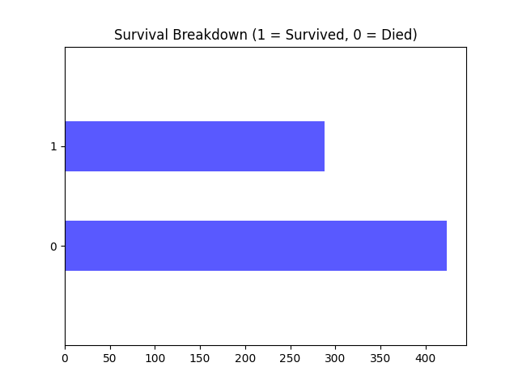

# Simple Pipeline Concept 

## What is this thing? 
When you work with any workflow in Kedro you have to interact with the following files:
- `catalog.yaml` for your data sources in configuration 
- `nodes.py` for your Python functions
- `pipline.py` to build your pipeline using `nodes.py`
- `hooks.py` to register your pipeline so that it appears on the CLI
- `parameters.yaml` for your parameters in configuration (not used in this example)

An insight from the user research has shown that this workflow is overwhelming for users that are used to a one-file
 interaction with a Jupyter notebook. This design proposes
 introducing users to a
 two-file workflow: 
- `catalog.yaml` for data source configuration
- A single `pipeline.py` file that merges the `pipeline.py` and `nodes.py` file into one thing

>_Note:_ The simple pipeline concept uses Kedro as a library but this restricts access to the Kedro CLI.

## Setup
- Create a Python virtual environment with Python 3.7 and activate it
- Run `pip install "kedro[pandas.CSVDataSet]" && pip install matplotlib"`
- Use the terminal to run `pipeline.py` by typing `python pipeline.py`

## Prototype

_pipeline.py_
```
import matplotlib.pyplot as plt
from kedro.config import ConfigLoader
from kedro.io import DataCatalog
from kedro.pipeline import Pipeline, node
from kedro.runner import SequentialRunner

conf_loader = ConfigLoader(".")
conf_catalog = conf_loader.get("catalog*", "catalog*/**")

# Create the Data Catalog
io = DataCatalog.from_config(conf_catalog)


# Create nodes by writing Python functions
# Remove NaN values
def clean_raw_data(df):
    df = df.drop(["Ticket", "Cabin"], axis=1)
    df = df.dropna()
    return df


# Plot the amount of people who survived and who died.
def plot_survival_breakdown(df):
    plt.figure(figsize=(6, 4))
    fig, ax = plt.subplots()
    df.Survived.value_counts().plot(kind="barh", color="blue", alpha=0.65)
    ax.set_ylim(-1, len(df.Survived.value_counts()))
    plt.title("Survival Breakdown (1 = Survived, 0 = Died)")
    return fig


# Create nodes
clean_data_node = node(
    func=clean_raw_data, 
    inputs="titanic_training_data", 
    outputs="df_clean"
)

plot_survival_breakdown_node = node(
    func=plot_survival_breakdown, 
    inputs="df_clean", 
    outputs="survival_breakdown_chart"
)

# Assemble nodes into a pipeline
pipeline = Pipeline([clean_data_node, plot_survival_breakdown_node])

# Create a runner to run the pipeline
runner = SequentialRunner()

# Run the pipeline
print(runner.run(pipeline, io))
```

_catalog.yml_
```
# Input Dataset
titanic_training_data:
  type: pandas.CSVDataSet
  filepath: train.csv

# Chart Output
survival_breakdown_chart:
  type: matplotlib.MatplotlibWriter
  filepath: survival_breakdown.png
```
The output of `pipeline.py` creates the following image: 



## Credits
I used part of [Tam Nguyen's](https://github.com/tamsanh/kedro-introduction-tutorial) introductory tutorial to make this. And he credits:
- @agconti for their work that was used in the tutorial
- And Kaggle.com, the provider of this titanic dataset in the competition Titanic: Machine Learning from Disaster
